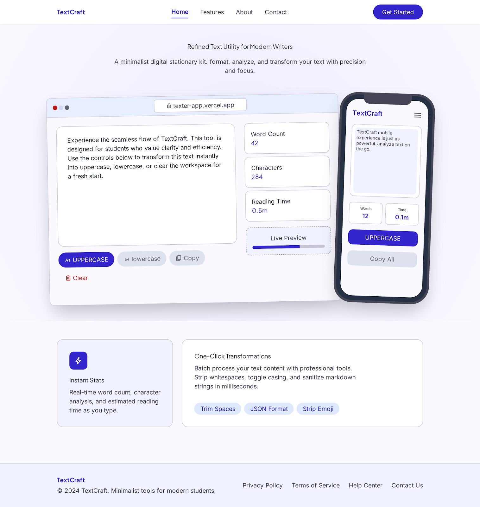

<div align="center">
  <br />
  
  <h1>Texter ✨</h1>
  <p><strong>A modern text utility app — transform, analyze, and manage your text instantly.</strong></p>

  <p>
    <a href="https://texter-pi.vercel.app/">
      
    </a>
    &nbsp;
    <a href="https://github.com/abdullah-alsaba/Texter">
      
    </a>
    &nbsp;
    
    &nbsp;
    
  </p>

  <br />

  

  <br /><br />

</div>

---

## 📌 Table of Contents

- [About](#-about)
- [Features](#-features)
- [Tech Stack](#️-tech-stack)
- [Getting Started](#-getting-started)
- [Project Structure](#-project-structure)
- [Goals](#-goals-of-this-project)
- [Contributing](#-contributing)
- [Author](#-author)

---

## 🧠 About

**Texter** is a lightweight, SaaS-inspired text utility web application designed to help users instantly manipulate and analyze text. No sign-up, no fluff — just a clean interface and powerful utilities.

Built as a hands-on portfolio project to practice React component architecture, responsive UI design, and modern Tailwind-based styling.

> 💡 Try it live → [texter-pi.vercel.app](https://texter-pi.vercel.app/)

---

## ✨ Features

<table>
  <thead>
    <tr>
      <th>Category</th>
      <th>Feature</th>
      <th>Description</th>
    </tr>
  </thead>
  <tbody>
    <tr>
      <td rowspan="5"><strong>🔧 Text Tools</strong></td>
      <td>🔠 Uppercase</td>
      <td>Convert all text to uppercase</td>
    </tr>
    <tr>
      <td>🔡 Lowercase</td>
      <td>Convert all text to lowercase</td>
    </tr>
    <tr>
      <td>✂️ Remove Spaces</td>
      <td>Strip out extra/duplicate whitespace</td>
    </tr>
    <tr>
      <td>📋 Copy Text</td>
      <td>One-click copy to clipboard</td>
    </tr>
    <tr>
      <td>🗑️ Clear Text</td>
      <td>Instantly reset the editor</td>
    </tr>
    <tr>
      <td rowspan="3"><strong>📊 Analytics</strong></td>
      <td>📊 Word Counter</td>
      <td>Real-time word count</td>
    </tr>
    <tr>
      <td>🔢 Character Counter</td>
      <td>Real-time character count</td>
    </tr>
    <tr>
      <td>⏱️ Reading Time</td>
      <td>Estimated reading time based on word count</td>
    </tr>
    <tr>
      <td rowspan="3"><strong>🎨 UX/UI</strong></td>
      <td>👀 Live Preview</td>
      <td>See output update as you type</td>
    </tr>
    <tr>
      <td>📱 Responsive</td>
      <td>Fully optimized for all screen sizes</td>
    </tr>
    <tr>
      <td>🎨 Modern UI</td>
      <td>Clean, SaaS-style interface</td>
    </tr>
  </tbody>
</table>

---

## 🛠️ Tech Stack

| Technology | Purpose |
|---|---|
| ⚛️ [React](https://react.dev/) | Component-based UI framework |
| 🎨 [Tailwind CSS](https://tailwindcss.com/) | Utility-first CSS styling |
| 🌼 [DaisyUI](https://daisyui.com/) | Pre-built Tailwind component library |
| 🔥 [Lucide React](https://lucide.dev/) | Clean, consistent icon set |
| ⚡ [Vite](https://vitejs.dev/) | Lightning-fast dev server & build tool |

---

## 🚀 Getting Started

### Prerequisites

Make sure you have the following installed:

- **Node.js** `v16+` — [Download](https://nodejs.org/)
- **npm** `v7+` (comes with Node.js)

### Local Setup

```bash
# Clone the repository
git clone https://github.com/abdullah-alsaba/Texter.git

# Move into the project folder
cd Texter

# Install dependencies
npm install

# Start the development server
npm run dev
```

Open [http://localhost:5173](http://localhost:5173) in your browser to see the app running.

### Build for Production

```bash
npm run build
```

The production-ready files will be in the `dist/` folder.

---

## 📁 Project Structure

```
Texter/
 ├── public/
 │   ├── favicon.svg           # App favicon
 │   ├── hero.png              # Hero section image
 │   └── mockup.png            # App mockup preview
 │
 ├── src/
 │   ├── components/
 │   │   ├── Navbar.jsx        # Top navigation bar
 │   │   ├── Hero.jsx          # Landing hero section
 │   │   ├── TextArea.jsx      # Core text editor & action buttons
 │   │   ├── Details.jsx       # Word / char / reading time stats
 │   │   ├── FAQ.jsx           # Frequently asked questions section
 │   │   └── Footer.jsx        # Page footer
 │   │
 │   ├── App.jsx               # Root component — wires all sections together
 │   ├── main.jsx              # React entry point
 │   └── index.css             # Global base styles
 │
 ├── index.html                # HTML shell
 ├── vite.config.js            # Vite configuration
 ├── package.json              # Project dependencies & scripts
 └── README.md
```

---

## 🎯 Goals of This Project

This project was built with clear learning objectives in mind:

- [x] Practice **React fundamentals** — state management, props, component architecture
- [x] Strengthen **Tailwind CSS** skills — responsive layouts, utility-first design
- [x] Learn **DaisyUI** component integration
- [x] Build a **SaaS-style UI** with a clean, professional feel
- [x] Create a complete, **deployable portfolio project**

---

## 🤝 Contributing

Contributions, bug reports, and feature suggestions are welcome!

1. Fork the repository
2. Create a new branch: `git checkout -b feature/your-feature`
3. Commit your changes: `git commit -m "Add your feature"`
4. Push to the branch: `git push origin feature/your-feature`
5. Open a Pull Request

---

## 👨‍💻 Author

**Abdullah Al Saba**

<a href="https://github.com/abdullah-alsaba">
  
</a>

---

## 📄 License

This project is open source and available under the [MIT License](LICENSE).

---

<div align="center">

If you found Texter useful, please consider giving it a ⭐ on [GitHub](https://github.com/abdullah-alsaba/Texter) — it helps a lot!

<br />

Made with ❤️ by <a href="https://github.com/abdullah-alsaba">Abdullah Al Saba</a>

</div>
